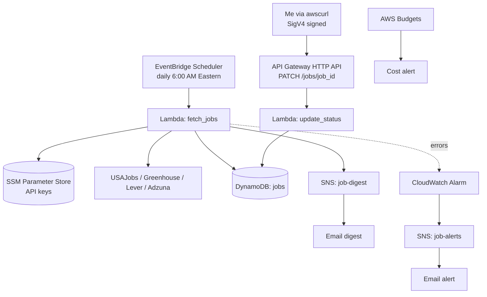

# Doomscroll

**I automated my doomscrolling.**

Doomscroll is a serverless job search tracker built on AWS and deployed entirely with Terraform. Every morning it pulls new postings from four public job APIs, filters them for the roles I'm targeting, stores the new matches in DynamoDB, and emails me a digest. I track each application's status through a small IAM protected API.

It's a personal tool, but it's built the way a production service should be: infrastructure as code, keyless CI/CD through GitHub OIDC, least privilege IAM, automated security scanning, monitoring, and a cost guardrail.


---

## Table of Contents

- [Why This Exists](#why-this-exists)
- [Architecture](#architecture)
- [How It Works](#how-it-works)
- [Design Decisions](#design-decisions)
- [Security](#security)
- [CI/CD Pipeline](#cicd-pipeline)
- [Repository Layout](#repository-layout)
- [Setup](#setup)
- [Usage](#usage)
- [Testing](#testing)
- [Monitoring and Cost](#monitoring-and-cost)
- [Roadmap](#roadmap)
- [Out of Scope](#out-of-scope)
- [Teardown](#teardown)

---

## Why This Exists

Job searching means checking the same boards every day, losing track of what you applied to, and repeating the process tomorrow. That's a scheduling, storage, and notification problem, which is exactly what serverless AWS is good at.

The project has three goals:

1. **Solve a real problem.** Replace manual daily searching with an automated pipeline and a single source of truth for application status.
2. **Demonstrate production practices.** Every resource is defined in Terraform, every change goes through a reviewed pull request, and every deployment is automated.
3. **Stay cheap.** The whole stack is designed to run at or near the AWS free tier.

---

## Architecture



| Component | AWS Service | Configuration |
|---|---|---|
| Schedule | EventBridge Scheduler | `cron(0 6 * * ? *)`, `America/New_York` |
| Fetcher | Lambda `fetch_jobs` | Python 3.12, 256 MB, 5 minute timeout |
| Status API | API Gateway HTTP API + Lambda `update_status` | IAM auth, Python 3.12, 128 MB, 10 second timeout |
| Storage | DynamoDB `jobs` | On demand billing, `status-index` GSI |
| Notifications | SNS `job-digest` and `job-alerts` | Email subscriptions |
| Secrets | SSM Parameter Store | SecureString |
| Logging | CloudWatch Logs | 14 day retention |
| Alerting | CloudWatch Alarm | `fetch_jobs` errors >= 1 per day |
| Cost control | AWS Budgets | Monthly budget with email alerts |
| State | S3 backend | Versioned, encrypted, native state locking |
| Region | us-east-1 | |

---

## How It Works

### Daily fetch

1. EventBridge Scheduler triggers `fetch_jobs` at 6:00 AM Eastern.
2. The function loads keyword filters from `config/filters.json` and reads API credentials from SSM Parameter Store.
3. It pulls postings from each source and normalizes them into one shared schema.
4. A posting matches if its title contains at least one include keyword and no exclude keyword (case insensitive).
5. Each match is written with a conditional `PutItem` (`attribute_not_exists(job_id)`), so a job is only stored once.
6. Only newly inserted jobs go into the email digest. If nothing is new, no email is sent.
7. If any source fails, the function logs it, finishes processing the others, and then raises so the CloudWatch alarm fires.

Reruns are safe. Deduplication means a rerun only reports jobs that are genuinely new.

### Job sources

| Source | Auth | Purpose |
|---|---|---|
| [USAJobs](https://developer.usajobs.gov/) | API key + contact email in User-Agent | Federal roles |
| [Greenhouse](https://developers.greenhouse.io/job-board.html) | Public | Selected company boards |
| [Lever](https://github.com/lever/postings-api) | Public | Selected company boards |
| [Adzuna](https://developer.adzuna.com/) | App ID + App Key | General listings |

No scraping. Every source is an official, documented API used within its published terms.

### Data model

Table `jobs`, partition key `job_id` formatted as `{source}_{source_job_id}` (for example, `usajobs_812345`).

| Attribute | Type | Notes |
|---|---|---|
| `job_id` | S | Partition key |
| `source` | S | `usajobs`, `greenhouse`, `lever`, `adzuna` |
| `title` | S | |
| `company` | S | |
| `location` | S | |
| `url` | S | |
| `posted_at` | S | ISO 8601, when provided by the source |
| `matched_keywords` | L | Keywords that triggered the match |
| `status` | S | `New`, `Applied`, `Interview`, `Offer`, `Rejected`, `Ghosted` |
| `first_seen_at` | S | ISO 8601 |
| `status_updated_at` | S | ISO 8601 |
| `notes` | S | Optional |

**GSI `status-index`:** partition key `status`, sort key `first_seen_at`. This supports queries like "everything I've applied to, newest first."

`Ghosted` covers applications that never received a response, so they can be closed out without being miscounted as rejections.

---

## Design Decisions

| Decision | Reasoning |
|---|---|
| IAM (SigV4) auth instead of an API key | No shared secret to leak. Access is tied to an IAM identity and governed by policy. |
| SSM Parameter Store instead of Secrets Manager | Standard parameters are free. Secrets Manager charges per secret, and rotation isn't needed here. |
| Secrets set outside Terraform | Parameters are created with a placeholder and `ignore_changes`. Real values never touch Terraform state or git. |
| checkov instead of tfsec | tfsec has been folded into Trivy. checkov is actively maintained and has broad AWS coverage. |
| Flat Terraform files, no modules | One environment, one stack. Modules get introduced when there's something worth reusing. |
| No Lambda layers | Python standard library plus the boto3 bundled in the runtime keeps packaging simple. |
| On demand DynamoDB | Traffic is a few dozen writes per day. Provisioned capacity would be wasted spend. |
| Two SNS topics | Digests and operational alerts serve different purposes and shouldn't share an inbox rule. |
| Conditional writes for deduplication | DynamoDB enforces uniqueness at write time. No read before write, no race conditions. |

---

## Security

- **No long lived credentials.** GitHub Actions authenticates to AWS through OIDC. There are no IAM users or access keys anywhere in the pipeline.
- **Separated CI roles.** The `ci-plan` role trusts pull requests only and has read only access. The `ci-apply` role trusts the `main` branch only and is scoped to the services in this stack. Neither role uses `AdministratorAccess`.
- **Least privilege Lambda roles.** Each function gets only the actions it needs on specific resource ARNs. No wildcards.

| Role | Trusted By | Permissions |
|---|---|---|
| `fetch_jobs` | Lambda | `dynamodb:PutItem` on `jobs`, `ssm:GetParameter` on three parameter ARNs, `sns:Publish` on `job-digest`, its own log group |
| `update_status` | Lambda | `dynamodb:UpdateItem` on `jobs`, its own log group |
| `ci-plan` | GitHub OIDC (pull requests) | `ReadOnlyAccess` plus state bucket access |
| `ci-apply` | GitHub OIDC (`main` branch) | Scoped to this stack's services |

- **Authenticated API.** Unsigned requests to the status API are rejected by API Gateway with a 403 before they reach Lambda.
- **Encrypted state.** The Terraform state bucket is versioned, encrypted, and blocks all public access.
- **Automated scanning.** checkov runs on every pull request. Any skipped check requires an inline justification:

```hcl
#checkov:skip=CKV_AWS_117:Lambda only calls public APIs, no VPC needed
```

---

## CI/CD Pipeline

`main` is protected. Every change requires a pull request with passing checks.

**Pull request (`pr.yml`, `ci-plan` role)**

1. `terraform fmt -check`
2. `terraform validate`
3. `checkov -d infra`
4. `pytest`
5. `terraform plan`

**Merge to main (`deploy.yml`, `ci-apply` role)**

1. Repeats checks 1 through 4
2. `terraform apply -auto-approve`

Lambda code is packaged with Terraform's `archive_file` data source, so application changes and infrastructure changes ship through the same pipeline.

---

## Repository Layout

```
doomscroll/
├── infra/
│   ├── bootstrap/          # State bucket, GitHub OIDC provider, CI roles
│   └── app/                # Application stack
│       ├── versions.tf
│       ├── backend.tf
│       ├── providers.tf
│       ├── variables.tf
│       ├── dynamodb.tf
│       ├── lambda.tf
│       ├── scheduler.tf
│       ├── api.tf
│       ├── sns.tf
│       ├── ssm.tf
│       ├── iam.tf
│       ├── monitoring.tf
│       └── outputs.tf
├── src/
│   ├── fetch_jobs/
│   └── update_status/
├── config/
│   └── filters.json
├── tests/
│   └── fixtures/           # Saved sample API responses
└── .github/workflows/
    ├── pr.yml
    └── deploy.yml
```

---

## Setup

### Prerequisites

- AWS account with credentials configured locally (bootstrap only)
- Terraform 1.11 or newer
- Python 3.12
- API credentials for [USAJobs](https://developer.usajobs.gov/APIRequest/) and [Adzuna](https://developer.adzuna.com/)
- [`awscurl`](https://github.com/okigan/awscurl) for calling the status API

### 1. Bootstrap (one time, from a local machine)

The bootstrap stack creates the resources the pipeline depends on: the state bucket, the GitHub OIDC provider, and both CI roles.

```bash
cd infra/bootstrap
terraform init
terraform apply
```

After the first apply, migrate the bootstrap state into the new bucket:

```bash
terraform init -migrate-state
```

### 2. Configure filters

Edit `config/filters.json`:

```json
{
  "include_keywords": ["cloud", "devops", "devsecops", "embedded", "iot"],
  "exclude_keywords": [],
  "locations": [],
  "greenhouse_boards": [],
  "lever_companies": []
}
```

### 3. Deploy the application

Open a pull request. Once it's reviewed and merged, GitHub Actions deploys the stack.

### 4. Set secrets

Terraform creates the parameters with a placeholder value. Set the real values once:

```bash
aws ssm put-parameter --name /doomscroll/usajobs/api_key --type SecureString --value "YOUR_KEY" --overwrite
aws ssm put-parameter --name /doomscroll/adzuna/app_id   --type SecureString --value "YOUR_ID"  --overwrite
aws ssm put-parameter --name /doomscroll/adzuna/app_key  --type SecureString --value "YOUR_KEY" --overwrite
```

### 5. Confirm email subscriptions

SNS sends a confirmation email for `job-digest` and `job-alerts`. Click both links. Terraform can't do this step for you.

---

## Usage

### Update a job's status

```bash
awscurl --service execute-api --region us-east-1 -X PATCH \
  -H "Content-Type: application/json" \
  -d '{"status": "Applied", "notes": "Referred by a former coworker"}' \
  https://API_ID.execute-api.us-east-1.amazonaws.com/jobs/usajobs_812345
```

| Response | Meaning |
|---|---|
| `200` | Status updated. Returns the updated item. |
| `400` | Invalid status value. |
| `403` | Request wasn't signed or the caller isn't authorized. |
| `404` | No job with that ID. |

### View jobs by status

```bash
aws dynamodb query --table-name jobs --index-name status-index \
  --key-condition-expression "#s = :s" \
  --expression-attribute-names '{"#s":"status"}' \
  --expression-attribute-values '{":s":{"S":"Applied"}}'
```

`status` is a DynamoDB reserved word, which is why the query uses an expression attribute name.

---

## Testing

Unit tests run with `pytest` and cover:

- Keyword filter logic
- Each source parser, tested against saved API responses in `tests/fixtures/`
- Status validation for the update API

CI never calls live APIs. Tests are deterministic and free to run.

```bash
pytest
```

---

## Monitoring and Cost

- **Logs:** CloudWatch log groups are created by Terraform with 14 day retention, so nothing accumulates indefinitely.
- **Alarm:** Any `fetch_jobs` error within a day triggers an email through `job-alerts`.
- **Budget:** AWS Budgets sends an email at 80% of actual spend and 100% of forecasted spend.
- **Expected cost:** At or near the AWS free tier at this volume.

---

## Roadmap

| Milestone | Target | Done When |
|---|---|---|
| M1: Foundation | Oct 4, 2026 | Bootstrap applied, remote state working, both pipelines deploying the DynamoDB table |
| M2: Fetcher | Oct 18, 2026 | `fetch_jobs` pulls all four sources, filters, and writes on schedule |
| M3: Loop Closed | Nov 1, 2026 | Digest emails, status API, alarm, and budget all live |
| M4: Ship It | Nov 8, 2026 | Documentation, architecture diagram, and write up published |

### Definition of done

- [ ] GitHub Actions builds the entire app stack from `main`
- [ ] The schedule runs seven consecutive days with no alarms
- [ ] New matches land in DynamoDB with no duplicates across runs
- [ ] The digest arrives whenever there are new jobs
- [ ] Status updates work through the API, and unsigned calls return 403
- [ ] checkov passes, with a documented reason for every skip
- [ ] The budget alert is active
- [ ] `terraform destroy` removes everything cleanly

---

## Out of Scope

These are intentional exclusions, not missing features:

- **No automated applications.** The tool finds and tracks jobs. Applying stays human.
- **No scraping.** LinkedIn and Indeed are excluded because they don't offer public job APIs.
- **No frontend dashboard** in v1. The CLI covers the use case.
- **No multi region, Kubernetes, or service mesh.** The workload doesn't justify them.
- **Not a SaaS.** Single user, single environment.

### Known limitation

The same job listed on two sources is stored twice, since each source assigns its own ID. Acceptable for v1.

---

## Teardown

```bash
cd infra/app
terraform destroy
```

The bootstrap stack is destroyed separately and last, since it holds the state bucket.

---

## Author

**Chris Norton Jr.**
[chrisnortonjr.com](https://chrisnortonjr.com)
